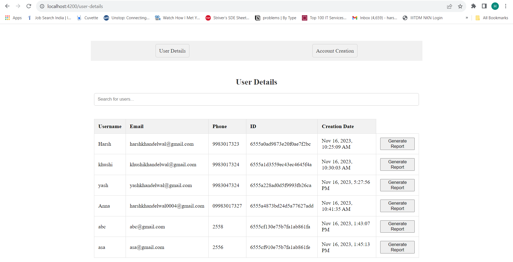
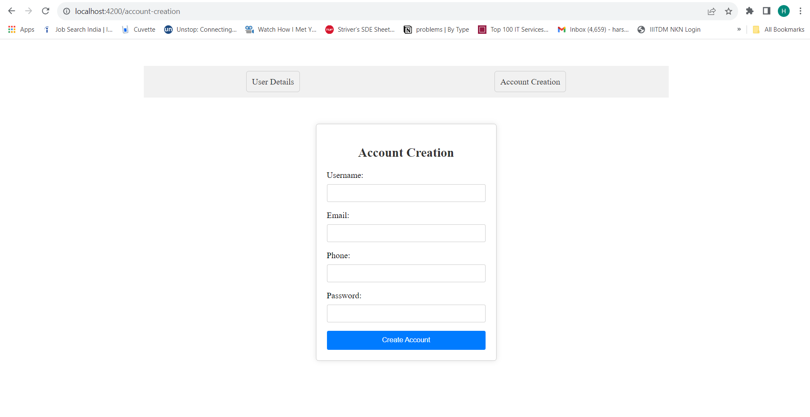
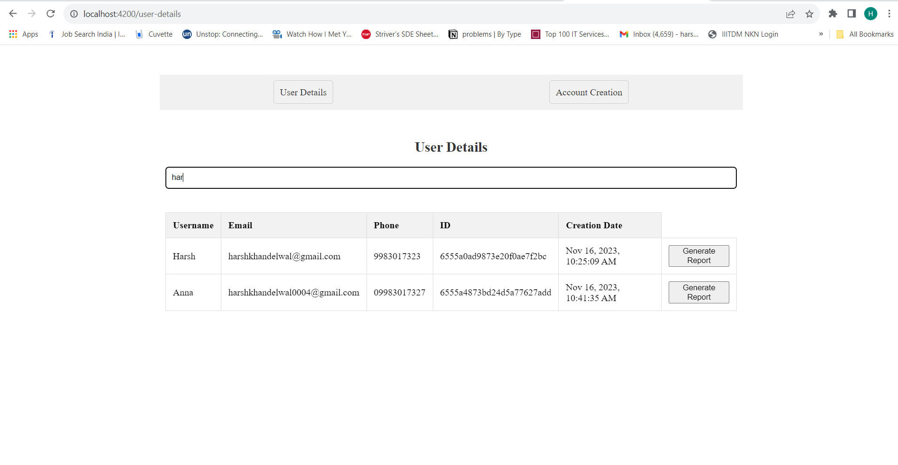
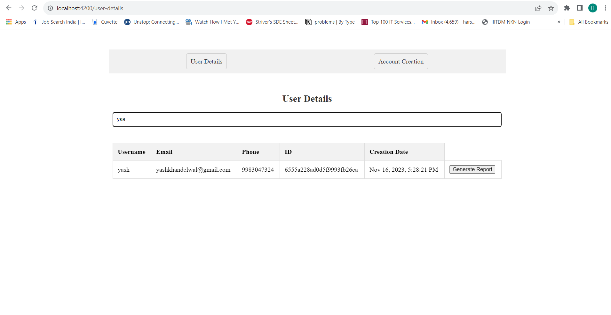

# Web Application: User Management Dashboard

This web application features a user management dashboard with two tabs: User Details and Account Creation. 

The User Details tab displays user information fetched from a placeholder database in a searchable table format.

The Account Creation tab consists of a form for username and password input.

## Features

1. **User Details Tab:**
   - Fetches user data from a placeholder database.
   - Implements a searchable table displaying user information: Username, Email, Phone, ID, and Creation date.
   - Enables a click action on any user in the search results to open a popup/modal with a button to generate a report for the selected user.

2. **Account Creation Tab:**
   - Creates a form with fields for username and password.
   - Implements dummy request handling upon form submission.\

3. **Tech Stack:**
   - Frontend: Angular.js
   - Styling: CSS
   - Backend: NodeJs 
   - Database: MongoDB

## Running Application

git clone git@github.com:khandelwalHarsh24/user_Management.git

## Screenshots

